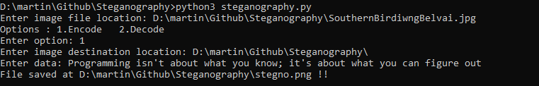
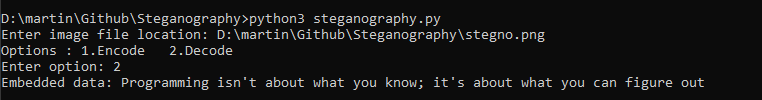

# Steganography using Python

  **Steganography** is the technique of hiding secret data within an ordinary, non-secret, file or message in order to avoid detection; the secret data is then extracted at its destination. The use of **steganography** can be combined with encryption as an extra step for hiding or protecting data.

> A cryptex. They are used to keep secrets. It's da Vinci's design. :smile:

## :camera: Image used for hiding data

## :paintbrush: Hiding Data
Run the file *steganography.py* on console. Enter the image file location and data to be hidden.

##  :mag_right: Revealing Data
Run the same file *steganography.py*. Enter the steganographed image file location and the hidden data will be printed.

> No changes will be visible in the steganographed images for small data :wink:
